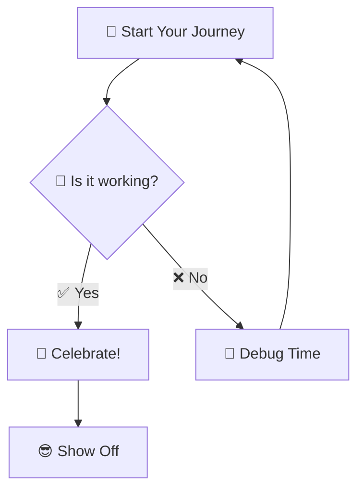

# 🧜‍♀️ Markdown Mermaid Viewer

[](https://marketplace.visualstudio.com/items?itemName=SankarMantripragada.markdown-mermaid-viewer)
[](LICENSE)
[](https://code.visualstudio.com/)

> 🎨 **Transform your boring text diagrams into beautiful, interactive visuals!** ✨

A delightful Visual Studio Code extension that automatically renders Mermaid diagrams in Markdown preview. Say goodbye to ugly code blocks and hello to stunning visual diagrams! 🚀

## ✨ Features

- 🪄 **Automatic Rendering**: Mermaid diagrams appear seamlessly in your Markdown preview
- 🌙☀️ **Theme Integration**: Adapts to your VS Code light and dark themes
- ⚡ **Live Updates**: Diagrams refresh instantly as you edit your content
- 🛡️ **Error Handling**: Provides helpful error messages for invalid syntax
- 🎭 **Zero Configuration**: Just install and start using immediately

## 🚀 Getting Started

1. 📦 **Install** the extension from VS Code Marketplace
2. 📝 **Open** any Markdown file with Mermaid diagrams
3. 👀 **Preview** with `Ctrl+Shift+V` (or `Cmd+Shift+V` on Mac)
4. 🎉 **View** your beautifully rendered diagrams

## 🎯 Example

Transform this code block:



Into a beautiful visual diagram! ✨

## 🎨 Supported Diagram Types

Our extension supports **ALL** Mermaid diagram types! 🌈

- 📊 **Flowcharts** - Perfect for process flows
- 🔄 **Sequence Diagrams** - Great for API interactions  
- 🏗️ **Class Diagrams** - Ideal for system architecture
- 🔀 **State Diagrams** - Perfect for state machines
- 🗂️ **Entity Relationship** - Database design made easy
- 🗺️ **User Journey** - Map your user experiences
- 📅 **Gantt Charts** - Project timelines at a glance
- 🥧 **Pie Charts** - Data visualization made simple
- 🌳 **GitGraph** - Visualize your git history
- ➕ **And many more!** - The possibilities are endless!

## 🛠️ Development

**For detailed development information, see [DEVELOPMENT.md](DEVELOPMENT.md)**

### Quick Start for Developers

1. 🍴 Fork this repository
2.  Install dependencies: `npm install`
3. 🚀 Launch extension: Press `F5`
4. 🧪 Test with `test.md`

### Build Commands

```bash
npm run compile  # Compile TypeScript
npm run watch    # Watch for changes
npm run package  # Package for distribution
```

## 🤝 Contributing

We welcome contributions! Here's how you can help improve this extension:

1. 🍴 **Fork** the repository
2. 🌿 **Create** a feature branch (`git checkout -b feature/amazing-feature`)
3. ✨ **Make** your changes
4. 🧪 **Test** thoroughly
5. 💌 **Submit** a pull request with a detailed description

### 🐛 Found a Bug?

Please [open an issue](https://github.com/mavsankar/markdown-mermaid-viewer/issues) and we'll address it promptly! �

## 💝 Support This Project

If this extension made your day a little brighter, consider:

- ⭐ Starring this repository
- 📝 Writing a review on the VS Code Marketplace
- 🐦 Sharing with your fellow developers
- ☕ [Buying me a coffee](https://example.com) (coming soon!)

## 📜 License

This project is licensed under the MIT License - see the [LICENSE](LICENSE) file for details.

---

**Made with ❤️ by [Sankar Mantripragada](https://github.com/mavsankar)**

*Transforming diagrams into visual masterpieces, one markdown file at a time!* ✨