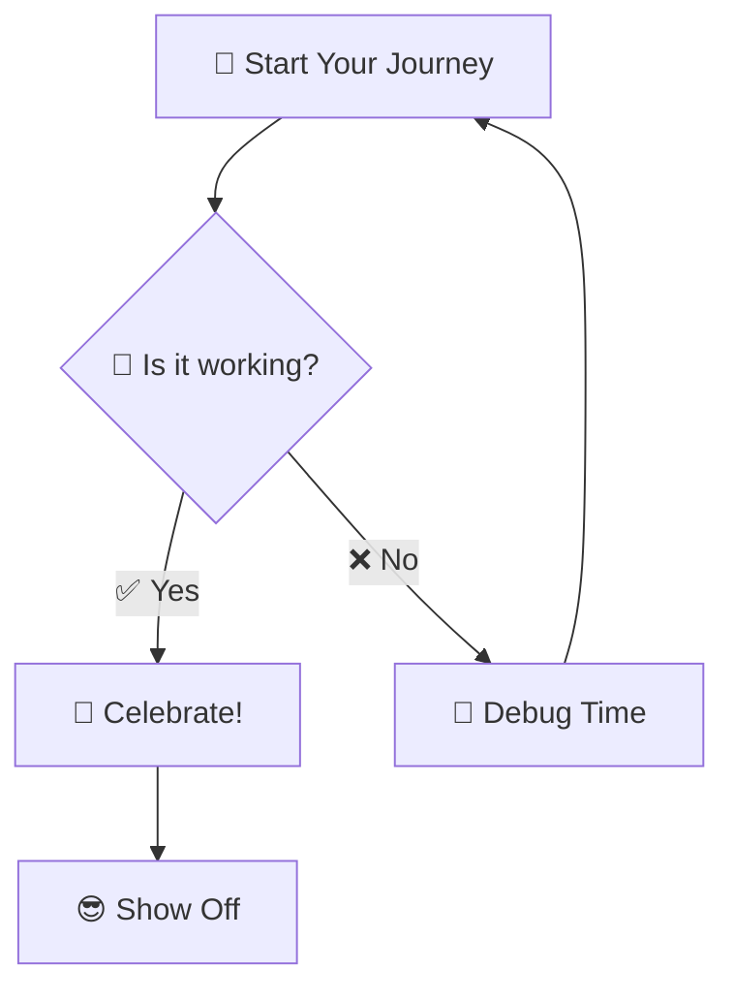

# 🧜‍♀️ Markdown Mermaid Viewer

> 🎨 **Transform your text diagrams into beautiful, interactive visuals!** ✨

A Visual Studio Code extension that automatically renders Mermaid diagrams in Markdown preview. Turn your code blocks into stunning visual diagrams with zero configuration! 🚀

## ✨ Features

- 🪄 **Automatic Rendering**: Mermaid diagrams appear seamlessly in your Markdown preview
- 🌙☀️ **Theme Integration**: Adapts to your VS Code light and dark themes
- ⚡ **Live Updates**: Diagrams refresh instantly as you edit your content
- 🛡️ **Error Handling**: Provides helpful error messages for invalid syntax
- 🎭 **Zero Configuration**: Just install and start using immediately

## 🚀 Getting Started

1. 📦 **Install** the extension from VS Code Marketplace
2. 📝 **Open** any Markdown file with Mermaid diagrams
3. 👀 **Preview** with `Ctrl+Shift+V` (or `Cmd+Shift+V` on Mac)
4. 🎉 **View** your beautifully rendered diagrams

## 🎯 Example

Transform this code block:

Into a beautiful visual diagram! ✨

## 🎨 Supported Diagram Types

This extension supports **ALL** Mermaid diagram types! 🌈

- 📊 **Flowcharts** - Perfect for process flows
- 🔄 **Sequence Diagrams** - Great for API interactions  
- 🏗️ **Class Diagrams** - Ideal for system architecture
- 🔀 **State Diagrams** - Perfect for state machines
- 🗂️ **Entity Relationship** - Database design made easy
- 🗺️ **User Journey** - Map your user experiences
- 📅 **Gantt Charts** - Project timelines at a glance
- 🥧 **Pie Charts** - Data visualization made simple
- 🌳 **GitGraph** - Visualize your git history
- ➕ **And many more!** - The possibilities are endless!

## 💡 Tips & Tricks

- **Real-time editing**: Your diagrams update as you type
- **Error feedback**: Invalid syntax? We'll show you exactly what's wrong
- **Theme matching**: Diagrams automatically match your VS Code theme
- **All diagram types**: Every Mermaid diagram type is supported

## 🤝 Support & Feedback

- 🐛 **Found a bug? or Have a suggestion?** [Report/Share it here](https://github.com/mavsankar/markdown-mermaid-viewer/issues)
- ⭐ **Love the extension?** Please star the extension and leave a review!

## 📜 License

MIT License - see the full license in the repository.

---

**Made with ❤️ by [Sankar Mantripragada](https://mavsankar.com)**